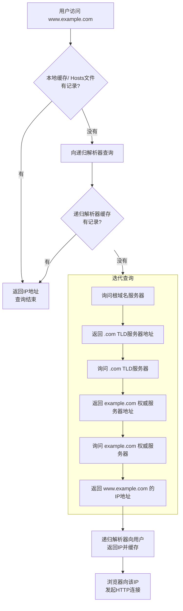

> [!abstract]+ 简单比喻：电话簿查询
> 想象一下你要找一个你不太熟悉的同事“张三”的电话号码：
>
> 1.  **检查手机通讯录**：你先在自己的手机通讯录里找“张三”。（**本地 DNS 缓存**）
> 2.  **询问办公室前台**：如果通讯录里没有，你会问公司前台，他们有一份全公司的电话簿。（**本地 DNS 解析器**）
> 3.  **前台查询总部分机目录**：前台也不知道，他会打电话给集团总部的人事部查询。（**根域名服务器**）
> 4.  **总部指引到分公司人事**：总部人事部说：“张三是上海分公司的，我给你上海分公司人事部的电话。”（**顶级域域名服务器**）
> 5.  **分公司人事提供号码**：前台打给上海分公司人事部，对方准确地给出了张三的分机号。（**权威域名服务器**）
> 6.  **前台告诉你号码**：前台把号码告诉你，同时自己也记录一下，下次有人问可以快速回答。（**缓存结果**）
> 7.  **你拨打号码**：你最终拿到号码，并打给张三。（**建立连接**）

## 技术性的 DNS 查询过程

DNS 查询的目标是将人类可读的域名（如 `www.google.com`）转换为机器可读的 IP 地址（如 `142.251.42.196`）。这个过程是分层的、分布式的。

一次完整的 DNS 查询会经历以下步骤。下图清晰地展示了这个过程：

现在，我们来详细说明图中的每一步。

### 第 1 步：检查本地缓存（浏览器 & 操作系统）

当你在浏览器中输入一个网址后，计算机会首先在以下地方查找是否有这个域名的 IP 地址缓存：

- **浏览器缓存**：浏览器会保存你最近访问过的网站的 DNS 记录。
- **操作系统缓存**：操作系统（如 Windows、macOS、Linux）也有自己的 DNS 缓存（例如，在 Windows 中可以通过 `ipconfig /displaydns` 命令查看）。
- **Hosts 文件**：操作系统还会检查本地的 `hosts` 文件，这个文件可以手动设置域名和 IP 的映射关系。

如果本地有记录且未过期，则直接使用该 IP，查询结束。

### 第 2 步：联系递归解析器

如果本地没有缓存，你的计算机会将查询请求发送到**递归解析器**。

- 这个解析器通常由你的**网络服务提供商（ISP）** 提供，你也可以使用公共的 DNS 解析器，如 `Google DNS (8.8.8.8)` 或 `Cloudflare DNS (1.1.1.1)`。
- 递归解析器有责任替你完成整个查询过程，直到给你返回最终的 IP 地址。它自己也有一个巨大的缓存。如果它缓存了你要查询的域名记录，它会直接返回给你，查询结束。

### 第 3 & 4 步：迭代查询过程（递归解析器的工作）

如果递归解析器也没有缓存，它就会开始一个“迭代查询”的过程，如下图所示，它会从上至下逐级查询全球的 DNS 系统。

- **询问根域名服务器**：

  - 递归解析器首先会去询问 13 组**根域名服务器**（分布在全球）。
  - 根服务器不存储具体域名的 IP，但它会查看域名的后缀（如 `.com`），然后返回负责该顶级域的 **TLD 域名服务器**的地址。
  - 这就好比问“世界的电话总局”：“请问谁知道 `.com` 区域的事？” 总局告诉你：“你去问 `.com` 分局吧，这是他们的地址。”

- **询问顶级域域名服务器**：

  - 递归解析器拿着地址，去询问 `.com` 的 TLD 服务器。
  - TLD 服务器存储着所有以 `.com` 结尾的域名的信息。它会查看下一部分（如 `example`），然后返回负责该域（`example.com`）的**权威域名服务器**的地址。
  - 这就好比问“.com 分局”：“请问谁知道 `example.com` 这个公司的事？” 分局告诉你：“你去问 `example.com` 公司自己的总机吧，这是他们的地址。”

- **询问权威域名服务器**：
  - 递归解析器最后去询问 `example.com` 的权威域名服务器。
  - 这个服务器是域名记录的最终来源，它掌握着该域名下所有主机的真实记录（如 `www`、`mail` 等）。它会查找记录，并将 `www.example.com` 对应的 IP 地址返回给递归解析器。
  - 这就好比问“公司的总机”：“请给我 `www` 这个部门的电话。” 总机准确地告诉了你号码。

### 第 5 步：返回结果并缓存

- 递归解析器终于拿到了 `www.example.com` 的 IP 地址。
- 它首先将这个记录**保存到自己的缓存**中一段时间（根据记录中的 TTL 值决定），以便下次快速响应。
- 然后，它将最终的 IP 地址**返回给你的操作系统**，操作系统也会缓存它，再传递给浏览器。

### 第 6 步：建立连接

- 浏览器现在拿到了 IP 地址，它就可以向该 IP 的 80（HTTP）或 443（HTTPS）端口发起 TCP 连接，开始加载网页内容。

---

## 重要的补充概念

- **递归查询 vs. 迭代查询**：

  - **递归查询**：发生在你的电脑和递归解析器之间。意思是：“我不管你怎么做，你必须给我最终答案（IP）或一个错误消息。”
  - **迭代查询**：发生在递归解析器和根、TLD、权威服务器之间。意思是：“我问你一个问题，如果你不知道答案，请告诉我下一个该问谁。”

- **DNS 记录类型**：

  - **A 记录**：将域名指向一个 IPv4 地址。
  - **AAAA 记录**：将域名指向一个 IPv6 地址。
  - **CNAME 记录**：将域名指向另一个域名（别名）。
  - **MX 记录**：指定接收邮件的服务器。
  - **NS 记录**：指定该域名由哪台权威服务器来解析。

- **DNS 的重要性**：
  DNS 是互联网的“基石”，它使得我们无需记忆复杂的数字 IP 地址。没有 DNS，今天的互联网将无法正常运转。
